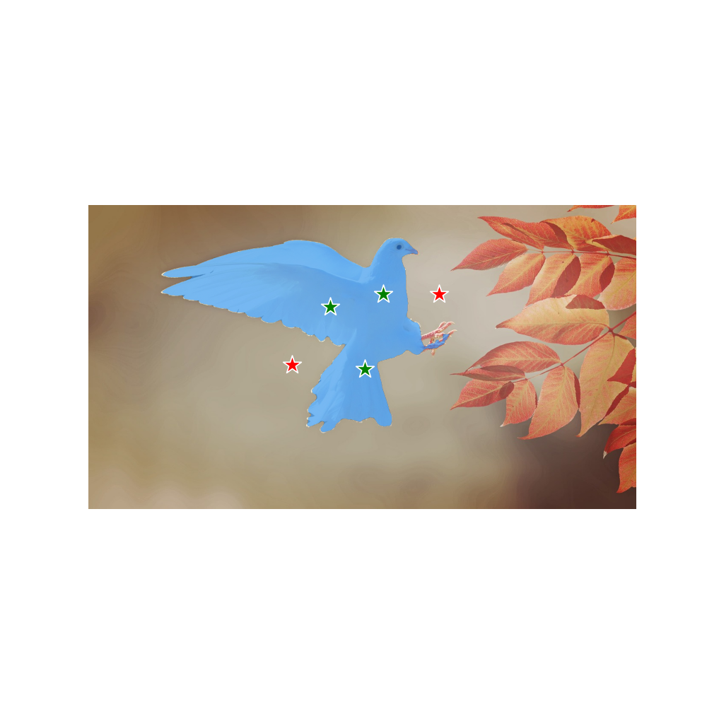
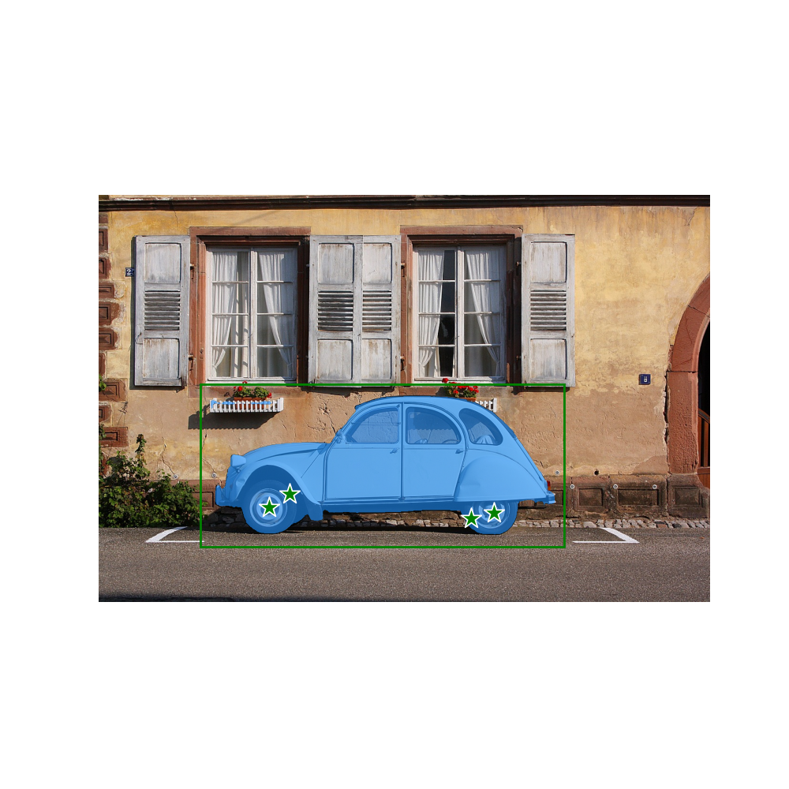
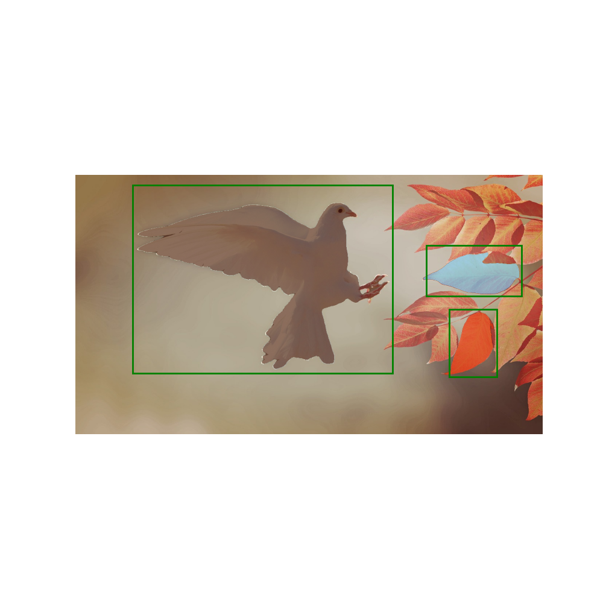
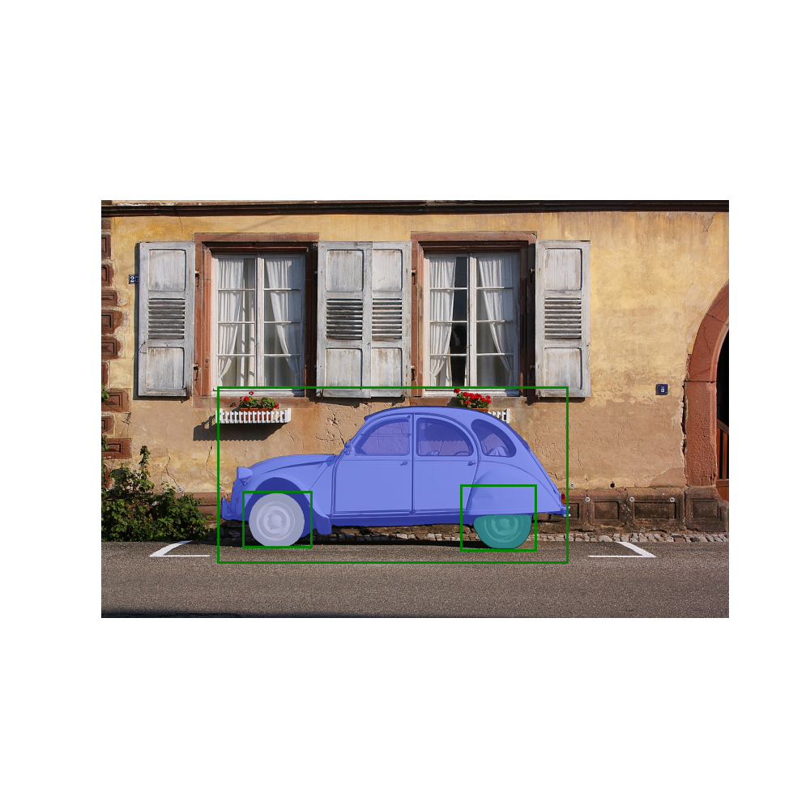

# SAM-Inference

Use **[Segment Anything](https://github.com/facebookresearch/segment-anything)** model in your local images

To run sam_inference.py, you need to be able to execute cv2.imshow() from OpenCV
- It may not be supported on some Linux systems

Korean tutorials : [my velog](https://velog.io/@kyyle/Segment-Anything-%EC%82%AC%EC%9A%A9%ED%95%B4-%EB%B3%B4%EA%B8%B0)

## Installation
- Minimal libraries: ```opencv-python, numpy, torch, matplotlib```
- CUDA is recommended, Please install CUDA and torch suitable for your GPU
- [Download](https://github.com/facebookresearch/segment-anything#model-checkpoints) **vit_h** model checkpoint

## How to Use 
- ```python sam_inference.py```
- Enter the Image Path : imgs/bird.jpg or imgs/car.jpg or your_image_path
- Select Segmentation Mode (Single / Multiple)
    - Single object segmentation mode supports multiple points and a single bbox
    - Multiple object segmentation mode supports multiple bboxes
- Press 'p' : Point mode
    - Positive point (Green)  : left mouse click
    - Negative point (Red) : right mouse click
- Press 'b' : Bbox mode
    - Mouse dragging
- Press 'r' : Reset all prompts
- Press 'i' : Model inference 
  - Segmentation results will be saved in ```results/```

## Examples 

### Single Object Segmentation Mode

| Single Point | Multiple Points|
|:---------:|:---------:|
|  |  |

| Multiple Points | Multiple Points and Single Bbox |
|:---------:|:---------:|
|  |  |

### Multiple Object Segmentation Mode

| Single Bbox | Multiple Bboxes |
|:---------:|:---------:|
|  |  |

| Multiple Bboxes | Multiple Bboxes |
|:---------:|:---------:|
|  |  |

You can also see an example code in SAM.ipynb

## Hardware

Works fine with GTX 1660 Ti
